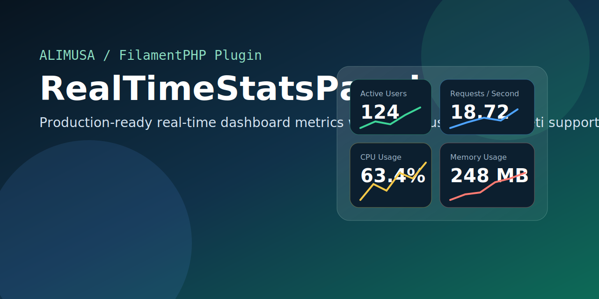
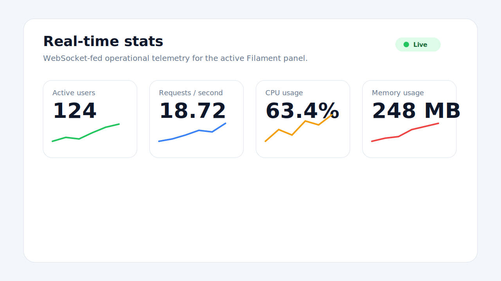

# RealTimeStatsPanel

<p align="center">
    
</p>

<p align="center">
    <a href="LICENSE.md"></a>
    <a href="https://github.com/alimusa80/real-time-stats-panel"></a>
    <a href="https://filamentphp.com/plugins"></a>
    <a href="https://www.alimusa.so/"></a>
</p>

Production-ready real-time dashboard metrics plugin for FilamentPHP with Laravel Echo and Pusher-compatible broadcasting.

## Author

- Author: Ali Musa
- Website: https://www.alimusa.so/
- GitHub: https://github.com/alimusa80

## Overview

`RealTimeStatsPanel` adds a responsive real-time stats widget to a Filament dashboard and streams updates over Laravel broadcasting using Echo plus any Pusher-compatible WebSocket server, including Pusher and Soketi.

It ships with:

- Filament panel plugin registration
- Laravel package service provider
- cache-backed stats manager
- private broadcast channels
- debounced frontend updates
- built-in metrics for active users, requests per second, CPU, and memory
- extensible collector pipeline for custom metrics
- simulation command for local demos and screenshots

## Preview

<p align="center">
    
</p>

## Compatibility

| Package | Supported |
| --- | --- |
| PHP | 8.2+ |
| Laravel | 11.x, 12.x |
| FilamentPHP | 4.x, 5.x |
| Livewire | 3.x |
| Broadcasters | Pusher-compatible drivers including Pusher and Soketi |

## Package Structure

```text
packages/alimusa/real-time-stats-panel
├── art
├── config
├── resources
│   ├── dist
│   └── views
├── routes
├── src
├── tests
├── CHANGELOG.md
├── CONTRIBUTING.md
├── LICENSE.md
├── README.md
├── SECURITY.md
└── composer.json
```

## Installation

If you are installing from a local `packages/` directory, add a path repository to your Laravel app's root `composer.json`:

```json
{
    "repositories": [
        {
            "type": "path",
            "url": "packages/alimusa/real-time-stats-panel",
            "options": {
                "symlink": true
            }
        }
    ]
}
```

Then require the package:

```bash
composer require alimusa/real-time-stats-panel:@dev
php artisan vendor:publish --tag=real-time-stats-panel-config
php artisan filament:assets
```

## Register the Filament Plugin

Register the plugin inside your Filament panel provider:

```php
use Alimusa\RealTimeStatsPanel\RealTimeStatsPanelPlugin;
use Filament\Panel;

public function panel(Panel $panel): Panel
{
    return $panel
        ->default()
        ->id('admin')
        ->path('admin')
        ->login()
        ->plugins([
            RealTimeStatsPanelPlugin::make()
                ->columnSpan('full')
                ->pollingInterval('30s')
                ->authorizeUsing(fn ($user, Panel $panel): bool => $user->can('viewFilamentRealTimeStats')),
        ]);
}
```

This automatically:

- registers request tracking middleware for the panel
- registers the stats widget on the dashboard
- uses the same authorization flow for widget visibility and private broadcast channel access

## Broadcasting Setup

### 1. Enable broadcasting routes in Laravel 12

Update your app bootstrap:

```php
<?php

use Illuminate\Foundation\Application;
use Illuminate\Foundation\Configuration\Exceptions;
use Illuminate\Foundation\Configuration\Middleware;

return Application::configure(basePath: dirname(__DIR__))
    ->withRouting(
        web: __DIR__ . '/../routes/web.php',
        api: __DIR__ . '/../routes/api.php',
        commands: __DIR__ . '/../routes/console.php',
        health: '/up',
    )
    ->withBroadcasting(
        __DIR__ . '/../routes/channels.php',
        ['middleware' => ['web', 'auth']]
    )
    ->withMiddleware(fn (Middleware $middleware) => null)
    ->withExceptions(fn (Exceptions $exceptions) => null)
    ->create();
```

### 2. Configure `config/broadcasting.php`

Use a Pusher-compatible driver:

```php
'default' => env('BROADCAST_CONNECTION', 'pusher'),

'connections' => [
    'pusher' => [
        'driver' => 'pusher',
        'key' => env('PUSHER_APP_KEY'),
        'secret' => env('PUSHER_APP_SECRET'),
        'app_id' => env('PUSHER_APP_ID'),
        'options' => [
            'cluster' => env('PUSHER_APP_CLUSTER'),
            'host' => env('PUSHER_HOST', '127.0.0.1'),
            'port' => env('PUSHER_PORT', 6001),
            'scheme' => env('PUSHER_SCHEME', 'http'),
            'useTLS' => env('PUSHER_SCHEME', 'http') === 'https',
            'encrypted' => env('PUSHER_SCHEME', 'http') === 'https',
        ],
    ],
],
```

### 3. Configure Filament Echo

Add this to your Filament config:

```php
'broadcasting' => [
    'echo' => [
        'broadcaster' => 'pusher',
        'key' => env('PUSHER_APP_KEY'),
        'cluster' => env('PUSHER_APP_CLUSTER'),
        'wsHost' => env('PUSHER_HOST', '127.0.0.1'),
        'wsPort' => env('PUSHER_PORT', 6001),
        'wssPort' => env('PUSHER_PORT', 6001),
        'authEndpoint' => '/broadcasting/auth',
        'forceTLS' => env('PUSHER_SCHEME', 'http') === 'https',
        'disableStats' => true,
    ],
],
```

### 4. Example environment

```dotenv
BROADCAST_CONNECTION=pusher

PUSHER_APP_ID=app-id
PUSHER_APP_KEY=app-key
PUSHER_APP_SECRET=app-secret
PUSHER_APP_CLUSTER=mt1
PUSHER_HOST=127.0.0.1
PUSHER_PORT=6001
PUSHER_SCHEME=http

REALTIME_STATS_CACHE_STORE=redis
```

## Metrics Included

Out of the box, the widget includes:

- Active users
- Requests per second
- CPU usage
- Memory usage

The widget shows each metric as a card with:

- current value
- short description
- trend label
- sparkline history
- live connection state

## Extending with New Metrics

Create a collector:

```php
<?php

namespace App\Filament\Stats;

use Alimusa\RealTimeStatsPanel\Contracts\StatsCollector;
use Alimusa\RealTimeStatsPanel\Support\StatsContext;

class QueueDepthCollector implements StatsCollector
{
    public function collect(StatsContext $context): array
    {
        $jobs = 24;

        return [
            'queue_depth' => [
                'label' => 'Queue depth',
                'value' => $jobs,
                'formatted_value' => number_format($jobs),
                'suffix' => 'jobs',
                'description' => 'Primary queue backlog',
                'color' => $jobs > 100 ? 'danger' : 'gray',
            ],
        ];
    }
}
```

Register it in `config/realtime-stats-panel.php`:

```php
'collectors' => [
    \Alimusa\RealTimeStatsPanel\Collectors\ActiveUsersCollector::class,
    \Alimusa\RealTimeStatsPanel\Collectors\RequestsPerSecondCollector::class,
    \Alimusa\RealTimeStatsPanel\Collectors\SystemUsageCollector::class,
    \App\Filament\Stats\QueueDepthCollector::class,
],
```

## Authorization

By default, the package uses:

- Filament panel access checks through `FilamentUser`, when available
- the `viewFilamentRealTimeStats` gate
- an optional plugin-level callback via `authorizeUsing()`
- an optional global config callback via `realtime-stats-panel.authorize`

This means you can lock the widget down with any existing app policy or permission layer.

## Dummy Data for Testing

To simulate a live dashboard:

```bash
php artisan realtime-stats-panel:simulate admin --iterations=60 --sleep=1
```

## Testing

The package includes a minimal Testbench-based smoke test scaffold.

```bash
composer install
composer test
```

## Filament Plugin Directory Readiness

This package is structured to be suitable for public distribution as a Filament plugin package:

- Composer package metadata included
- license included
- changelog included
- contribution and security docs included
- screenshots/artwork included
- GitHub Actions workflow included
- Filament plugin class included
- package service provider included

For a public Filament listing, you still need to:

1. Push the package to a public GitHub repository.
2. Publish the package on Packagist or another supported registry.
3. Submit or manage it through the Filament author portal.

## Changelog

See [CHANGELOG.md](CHANGELOG.md).

## Contributing

See [CONTRIBUTING.md](CONTRIBUTING.md).

## Security

See [SECURITY.md](SECURITY.md).

## License

This package is open-sourced software licensed under the [MIT license](LICENSE.md).
